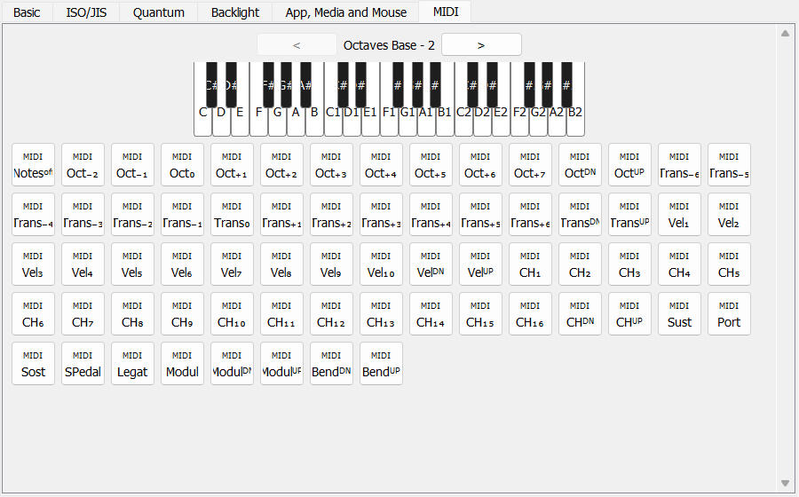
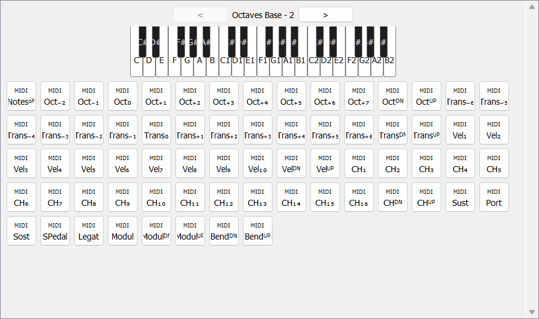

### vial-gui-midi

# Docs and getting started

### Please visit [get.vial.today](https://get.vial.today/) to get started with Vial

Vial is an open-source cross-platform (Windows, Linux and Mac) GUI and a QMK fork for configuring your keyboard in real time.


---

## Purpose of this fork

This fork adds a **MIDI tab** to the Vial keycode picker, so keyboards that expose MIDI
functionality (via QMK's MIDI feature) can be configured without leaving Vial. The tab
provides:

- A piano-style keyboard picker for assigning MIDI note keycodes, with octave navigation
  so you can reach every available octave.
- The remaining MIDI controls (velocity, channel, transpose, sustain/sostenuto/legato,
  modulation and pitch bend) laid out underneath the piano.
- A fallback to the plain keycode grid when the window is too narrow to fit the piano.

The tab is only shown for keyboards that declare MIDI support; boards without it are
unaffected.

### MIDI tab screenshots

Full keycode picker window with the new MIDI tab selected:



Close-up of the piano keyboard picker and MIDI controls:



---


#### Releases

Visit https://get.vial.today/ to download a binary release of Vial.

#### Development

##### Prerequisites

Python 3.6 is recommended (3.6 is the latest version that is officially supported by `fbs`).
You will also need:

- `pip` and the standard library `venv` module.
- `git` (dependencies are installed directly from a git URL).
- A C build toolchain, since `pip install` compiles the `hidapi` native extension:
  - Linux: `build-essential`, `libusb-1.0-0-dev`, `libudev-dev`.
  - macOS: Xcode Command Line Tools.
  - Windows: Visual Studio Build Tools ("Desktop development with C++").

Run the helper script below to check for these and optionally install anything missing
(it will always ask for confirmation before installing or running any command):

```
python util/check_prerequisites.py
```

##### Setup and running

Install dependencies:

```
python3 -m venv venv
source venv/bin/activate
pip install -r requirements.txt
```

To launch the application afterwards:

```
source venv/bin/activate
fbs run
```
